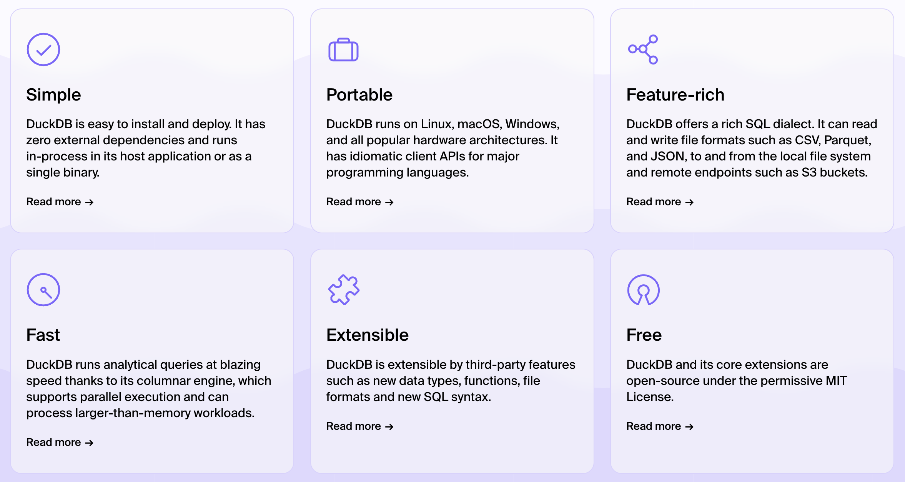
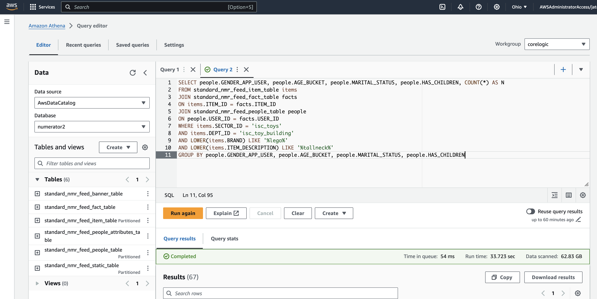

# Creating a DuckDB database from a dataset

There are lots of options out there for creating SQL databases, but a very powerful and free option is to use [DuckDB](https://duckdb.org/). The advantage of DuckDB is that has an API for just about every programming language out there (Python, C, R, Java, etc.) so you can use it however you like. It also requires very little set up as you can query directly from a flat file like a CSV, or multiple files, or from a partitioned file system for better efficiency.

We'll use the Numerator dataset that we have been using on AWS/Athena. This dataset is also available on KLC in the form of parquet files.

## What is parquet?

> Apache Parquet is an open source, column-oriented data file format designed for efficient data storage and retrieval. It provides efficient data compression and encoding schemes with enhanced performance to handle complex data in bulk. Apache Parquet is designed to be a common interchange format for both batch and interactive workloads.
-- [DataBricks](https://www.databricks.com/glossary/what-is-parquet)

Essentially, parquet files are tabular just like a CSV file, except they are also (1) compressed and (2) preserve the data types of each column, which makes them easy to load into a database and maintain integrity.

## Understanding the file system

The Numerator dataset on KLC lives here:

```/kellogg/data/numerator/data/parquet-part```


```python
ls -l /kellogg/data/numerator/data/parquet-part
```

    total 98
    drwxrwx--x+  2 wkt406 wkt406  4096 Jun 19 12:01 standard_nmr_feed_banner_table/
    drwxrwx--x+  2 wkt406 wkt406 65536 Jun 20 15:53 standard_nmr_feed_fact_table/
    drwxrwx--x+ 25 wkt406 wkt406  4096 Jun 30 12:36 standard_nmr_feed_item_table/
    drwxrwx--x+  2 wkt406 wkt406 16384 Jun 19 12:12 standard_nmr_feed_people_attributes_table/
    drwxrwx--x+ 13 wkt406 wkt406  4096 Jun 19 12:01 standard_nmr_feed_people_table/
    drwxrwx--x+ 77 wkt406 wkt406 16384 Jun 19 12:12 standard_nmr_feed_static_table/


Each subdirectory contains all the data from a single table, saved as multiple parquet files.

### Using the partitions

You can tell which tables are partitioned based on the naming of subdirectories. In this case, the item table directory is sub-divided into directories that contain parquet files of only a single SECTOR_ID.


```python
ls -l /kellogg/data/numerator/data/parquet-part/standard_nmr_feed_item_table
```

    total 353
    drwxrwx--x+ 2 wkt406 wkt406  4096 Jun 30 12:58 SECTOR_ID=/
    drwxrwx--x+ 2 wkt406 wkt406 16384 Jun 30 12:58 SECTOR_ID=isc_apparel/
    drwxrwx--x+ 2 wkt406 wkt406 16384 Jun 30 12:58 SECTOR_ID=isc_automotive/
    drwxrwx--x+ 2 wkt406 wkt406 16384 Jun 30 12:58 SECTOR_ID=isc_baby/
    drwxrwx--x+ 2 wkt406 wkt406 16384 Jun 30 12:58 SECTOR_ID=isc_books/
    drwxrwx--x+ 2 wkt406 wkt406 16384 Jun 30 12:58 SECTOR_ID=isc_electronics/
    drwxrwx--x+ 2 wkt406 wkt406 16384 Jun 30 12:58 SECTOR_ID=isc_entertainment/
    drwxrwx--x+ 2 wkt406 wkt406 16384 Jun 30 12:58 SECTOR_ID=isc_grocery/
    drwxrwx--x+ 2 wkt406 wkt406 16384 Jun 30 12:58 SECTOR_ID=isc_gro_household/
    drwxrwx--x+ 2 wkt406 wkt406 16384 Jun 30 12:58 SECTOR_ID=isc_gro_tobacco_products_and_accessories/
    drwxrwx--x+ 2 wkt406 wkt406 16384 Jun 30 12:58 SECTOR_ID=isc_health_and_beauty/
    drwxrwx--x+ 2 wkt406 wkt406 16384 Jun 30 12:58 SECTOR_ID=isc_home_and_garden/
    drwxrwx--x+ 2 wkt406 wkt406 16384 Jun 30 12:58 SECTOR_ID=isc_indeterminate_category/
    drwxrwx--x+ 2 wkt406 wkt406 16384 Jun 30 12:58 SECTOR_ID=isc_non_item/
    drwxrwx--x+ 2 wkt406 wkt406 16384 Jun 30 12:58 SECTOR_ID=isc_office/
    drwxrwx--x+ 2 wkt406 wkt406 16384 Jun 30 12:58 SECTOR_ID=isc_party_and_occasions/
    drwxrwx--x+ 2 wkt406 wkt406 16384 Jun 30 12:58 SECTOR_ID=isc_pet/
    drwxrwx--x+ 2 wkt406 wkt406 16384 Jun 30 12:58 SECTOR_ID=isc_qsr/
    drwxrwx--x+ 2 wkt406 wkt406 16384 Jun 30 12:58 SECTOR_ID=isc_restaurant/
    drwxrwx--x+ 2 wkt406 wkt406 16384 Jun 30 12:58 SECTOR_ID=isc_sports/
    drwxrwx--x+ 2 wkt406 wkt406 16384 Jun 30 12:58 SECTOR_ID=isc_tools_and_home_improvement/
    drwxrwx--x+ 2 wkt406 wkt406 16384 Jun 30 12:58 SECTOR_ID=isc_toys/
    drwxrwx--x+ 2 wkt406 wkt406 16384 Jun 30 12:58 SECTOR_ID=na/


## DuckDB



The main advantage of DuckDB over AWS/Athena is that it is free! You can also use it to build your own databases. It can work on any several different types of files (i.e., CSV, JSON, parquet, compressed/uncompressed, etc.).

Note: all the data used to build Kellogg AWS/Athena databases are available on KLC as parquet files.

### DuckDB/Python with Numerator

Duck DB can be used with Pandas to generate output in dataframes using the .fetchdf() method. You can specify the number of threads used in the query with the SET command.


```python
import duckdb
import pandas as pd
pd.set_option('display.max_columns', None)
```


```python
query = ''' 
SET threads to 16;
SELECT SECTOR_ID, COUNT(*) AS N
FROM read_parquet('/kellogg/data/numerator/data/parquet-part/standard_nmr_feed_item_table/*/*.parquet',
                    hive_partitioning=true)
GROUP BY SECTOR_ID;
'''
df = duckdb.query(query).fetchdf()
```


```python
df
```


<div>
<style scoped>
    .dataframe tbody tr th:only-of-type {
        vertical-align: middle;
    }

    .dataframe tbody tr th {
        vertical-align: top;
    }

    .dataframe thead th {
        text-align: right;
    }
</style>
<table border="1" class="dataframe">
  <thead>
    <tr style="text-align: right;">
      <th></th>
      <th>SECTOR_ID</th>
      <th>N</th>
    </tr>
  </thead>
  <tbody>
    <tr>
      <th>0</th>
      <td>isc_qsr</td>
      <td>3730900</td>
    </tr>
    <tr>
      <th>1</th>
      <td>isc_toys</td>
      <td>2986349</td>
    </tr>
    <tr>
      <th>2</th>
      <td>isc_indeterminate_category</td>
      <td>548714</td>
    </tr>
    <tr>
      <th>3</th>
      <td>isc_sports</td>
      <td>1067313</td>
    </tr>
    <tr>
      <th>4</th>
      <td>isc_tools_and_home_improvement</td>
      <td>2717426</td>
    </tr>
    <tr>
      <th>5</th>
      <td>na</td>
      <td>104810505</td>
    </tr>
    <tr>
      <th>6</th>
      <td>isc_non_item</td>
      <td>3120410</td>
    </tr>
    <tr>
      <th>7</th>
      <td>isc_office</td>
      <td>1559704</td>
    </tr>
    <tr>
      <th>8</th>
      <td>isc_apparel</td>
      <td>10987294</td>
    </tr>
    <tr>
      <th>9</th>
      <td>isc_automotive</td>
      <td>1270808</td>
    </tr>
    <tr>
      <th>10</th>
      <td>isc_baby</td>
      <td>2110536</td>
    </tr>
    <tr>
      <th>11</th>
      <td>isc_gro_household</td>
      <td>4783645</td>
    </tr>
    <tr>
      <th>12</th>
      <td>isc_grocery</td>
      <td>64920244</td>
    </tr>
    <tr>
      <th>13</th>
      <td>isc_books</td>
      <td>1067287</td>
    </tr>
    <tr>
      <th>14</th>
      <td>isc_electronics</td>
      <td>4094064</td>
    </tr>
    <tr>
      <th>15</th>
      <td>isc_entertainment</td>
      <td>251103</td>
    </tr>
    <tr>
      <th>16</th>
      <td>isc_health_and_beauty</td>
      <td>11536175</td>
    </tr>
    <tr>
      <th>17</th>
      <td>isc_party_and_occasions</td>
      <td>1841985</td>
    </tr>
    <tr>
      <th>18</th>
      <td>isc_pet</td>
      <td>3460306</td>
    </tr>
    <tr>
      <th>19</th>
      <td>isc_restaurant</td>
      <td>262553</td>
    </tr>
    <tr>
      <th>20</th>
      <td></td>
      <td>3</td>
    </tr>
    <tr>
      <th>21</th>
      <td>isc_home_and_garden</td>
      <td>8383213</td>
    </tr>
    <tr>
      <th>22</th>
      <td>isc_gro_tobacco_products_and_accessories</td>
      <td>1438334</td>
    </tr>
  </tbody>
</table>
</div>


### Query partitioned database of parquet files

Use the glob string to designate the path to all parquet files in a table. Set the parameter hive_partition = true so that the function recognizes that the file system is set up for partitioning.

The following query uses three tables in the numerator dataset to look up some demographics of consumers who purchased the Lego Horizon Forbidden West Tallneck set.

Let's break down this query:
- The items table (standard_nmr_feed_item_table) has a listing of all products purchased by consumers. It is partitioned by SECTOR_ID, so we make sure to include that field in the filter to only select toys. We also included the DEPT_ID to filter on "building" toys, the brand "Lego", and the keyword "tallneck" in the name of the set included in the description.
- We join with the facts table (standard_nmr_feed_fact_table), which links each purchase of an item (ITEM_ID) with a consumer that purchased it (USER_ID).
- We join a third table people (standard_nmr_feed_people_table) to the facts table on USER_ID to get the demographics of each individual consumer. Note, this people table is also partitioned by census regions; however, even though we aren't interested in the partitions, we still have to indicate that the file system is partitioned.
- We select only the demographic fields we are interested in: gender, age, marital status, and whether or not they have children.
- We can compress the output by asking for counts of each consumer breakout in an aggregate function (COUNT, GROUP BY) rather than listing every person.


```python
query = ''' 
SELECT people.GENDER_APP_USER, people.AGE_BUCKET, people.MARITAL_STATUS, people.HAS_CHILDREN, COUNT(*) AS N
FROM read_parquet('/kellogg/data/numerator/data/parquet-part/standard_nmr_feed_item_table/*/*.parquet',
                hive_partitioning=true) items
JOIN read_parquet('/kellogg/data/numerator/data/parquet-part/standard_nmr_feed_fact_table/*.parquet') facts
ON items.ITEM_ID = facts.ITEM_ID
JOIN read_parquet('/kellogg/data/numerator/data/parquet-part/standard_nmr_feed_people_table/*/*/*.parquet',
                hive_partitioning=true) people
ON people.USER_ID = facts.USER_ID
WHERE items.SECTOR_ID = 'isc_toys' 
AND items.DEPT_ID = 'isc_toy_building'
AND items.BRAND ILIKE '%lego%'
AND items.ITEM_DESCRIPTION ILIKE '%tallneck%'
GROUP BY people.GENDER_APP_USER, people.AGE_BUCKET, people.MARITAL_STATUS, people.HAS_CHILDREN
'''
df = duckdb.sql(query).fetchdf()
```


```python
df
```


<div>
<style scoped>
    .dataframe tbody tr th:only-of-type {
        vertical-align: middle;
    }

    .dataframe tbody tr th {
        vertical-align: top;
    }

    .dataframe thead th {
        text-align: right;
    }
</style>
<table border="1" class="dataframe">
  <thead>
    <tr style="text-align: right;">
      <th></th>
      <th>GENDER_APP_USER</th>
      <th>AGE_BUCKET</th>
      <th>MARITAL_STATUS</th>
      <th>HAS_CHILDREN</th>
      <th>N</th>
    </tr>
  </thead>
  <tbody>
    <tr>
      <th>0</th>
      <td>Male</td>
      <td>55-64</td>
      <td>Married</td>
      <td>No</td>
      <td>3</td>
    </tr>
    <tr>
      <th>1</th>
      <td>Male</td>
      <td>35-44</td>
      <td>Living with partner</td>
      <td>No</td>
      <td>5</td>
    </tr>
    <tr>
      <th>2</th>
      <td>Female</td>
      <td>45-54</td>
      <td>Divorced</td>
      <td>Yes</td>
      <td>6</td>
    </tr>
    <tr>
      <th>3</th>
      <td>Male</td>
      <td>35-44</td>
      <td>Married</td>
      <td>No</td>
      <td>6</td>
    </tr>
    <tr>
      <th>4</th>
      <td>Male</td>
      <td>18-20</td>
      <td>Never married</td>
      <td>Yes</td>
      <td>1</td>
    </tr>
    <tr>
      <th>...</th>
      <td>...</td>
      <td>...</td>
      <td>...</td>
      <td>...</td>
      <td>...</td>
    </tr>
    <tr>
      <th>62</th>
      <td>Female</td>
      <td>25-34</td>
      <td>Never married</td>
      <td>No</td>
      <td>8</td>
    </tr>
    <tr>
      <th>63</th>
      <td>Female</td>
      <td>35-44</td>
      <td>Living with partner</td>
      <td>No</td>
      <td>5</td>
    </tr>
    <tr>
      <th>64</th>
      <td>Female</td>
      <td>25-34</td>
      <td>Divorced</td>
      <td>Yes</td>
      <td>1</td>
    </tr>
    <tr>
      <th>65</th>
      <td>Female</td>
      <td>21-24</td>
      <td>Married</td>
      <td>Yes</td>
      <td>1</td>
    </tr>
    <tr>
      <th>66</th>
      <td>Male</td>
      <td>45-54</td>
      <td>Divorced</td>
      <td>No</td>
      <td>5</td>
    </tr>
  </tbody>
</table>
<p>67 rows × 5 columns</p>
</div>


This query takes about 10 minutes to run on KLC using the maximum number of threads. We can run the same query on Athena and get the same results in about 30 seconds.



### Why DuckDB if Athena is faster?

Duck DB is completely free! If you have a very heavy workload, you can utilize DuckDB to run queryies on KLC to and easily integrate the results into your R or Python code. It also serves as a good playground for testing queries before using Athena.

As shown, you can also use DuckDB to query any organized file system that may not be available on Athena (CSV, JSON, etc.), so you could create your own databases for any data specific to your research.
