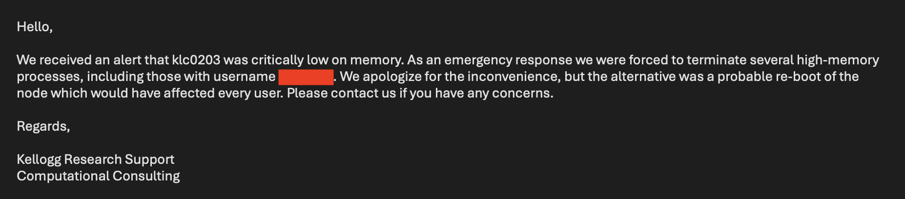

# Kellogg Linux Cluster

- Accessing KLC Datasets
- Loading data (DuckDB, Dataframes)
- Monitoring usage (memory)
- Parallelizing jobs (cores, nodes)
- Automation with scripts (including script args)


:::{admonition} Data Workflow
:class: note

```{figure} ./images/data-workflow-klc.png
---
width: 900px
name: data-workflow-klc
---
```

### What is "large?" Answer: depends on memory

Before we talk about large datasets, let's review the workflow for loading and analyzing small datasets. For example, say we have a simple flat text file containing several hundred rows of data and we wish to load the entire file into memory. We can see how much RAM is being used by this frame alone using the info method in Pandas or object_size in R.

```python
import pandas as pd
df = pd.read_csv('data.csv')
df.info()
```

```r
library(pryr)
df = read.csv('data.csv')
object_size(df)
```

More often than not, your research projects will require working with large datasets. We consider a "large" dataset to take up disk space on par or larger than the available memory on your working machine. If you are working on a laptop, your available RAM will most likely be only a few GB. If you are working on KLC, each node has 1.5-2.0 TB of memory.

### Don't get greedy!

However, even if you can download all of your data into memory, that doesn't mean that you should. If you use a significant fraction of memory soley to hold data, you'll likely experience significant performance issues when analyzing it. It's a smart idea to leave some free memory for processing data and also for other background processes to continue running unimpaired.

This practice becomes even more important when working on shared machines like KLC. Loading too much data into memory for your process may interfere with processes that other users on the node may be currently be running. Kellogg Research Support regularly scans processes on KLC and warns users when they are not only exceeding their CPU usage limits, but if they are being too "greedy" with memory usage on any given node, and if necessary, abort all processes for that user. 



There really is no rule of thumb for memory usage on KLC, as each case is different. Performance across all users usually gets impaired when >30% of memory is being used, so using <10% would be wise. That is approximately 100 GB.

If you follow this guide in the future, then you'll never have to worry about receiving these emails again!

